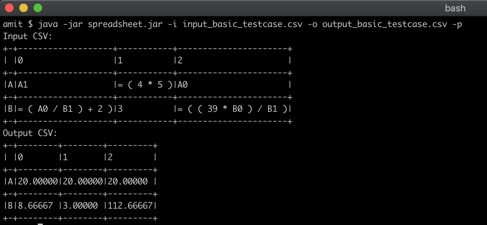

Coding Challenge
==================

The details about the coding challenge are [here](Coding-Challenge.md)
### Assumptions

- All the characters in the expression should be seperated by a space.
    Example:
    ```shell
    = ( A0 / B1 ) + 2 )
    ```
    
- For all the errors like cyclic dependencies, zero divisibility etc. the program will not exit but it will mark those cells as errored cells, so that they can be seen in the output csv file.    

### Building this code

```shell
mvn clean package assembly:single
```

This command will generate the packaged jar with this name "*spreadsheet-1.0-jar-with-dependencies.jar*" under the target directory

Rename this jar file to "*spreadsheet.jar*" and move it to the home working directory.

A pre-built jar file is already checked-in.

### Running this code

```shell
java -jar spreadsheet.jar -i input_basic_testcase.csv -o output_basic_testcase.csv -p
```


OR

```shell
java -jar spreadsheet.jar --inputCsvFile input_basic_testcase.csv --outputCsvFile output_basic_testcase.csv --prettyPrint
```

### Help on the command line runner

```shell
java -jar spreadsheet.jar --Help

Usage: <main class> [options]
  Options:
    --Help, -h

  * --inputCsvFile, -i
      Input CSV File
  * --outputCsvFile, -o
      Output CSV File
    --prettyPrint, -p
      Prints the files on console in pretty format
      Default: false      
```

#### Example Run:




